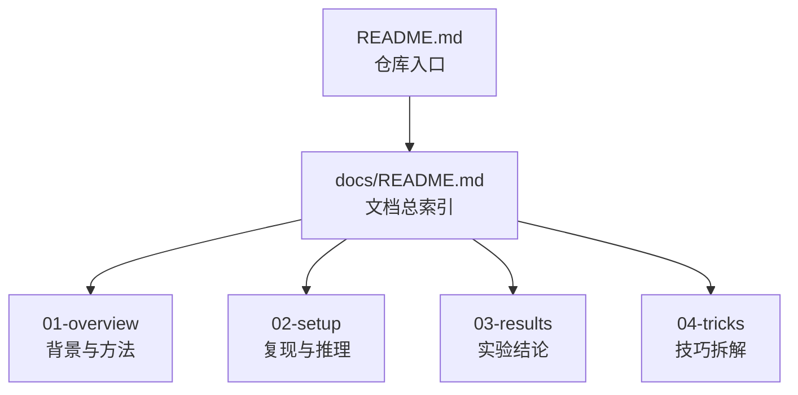

# RSNA-Learning

这是一个围绕 RSNA 颅内动脉瘤检测任务开展的学习型项目仓库，目标不是只做一次性复现，而是把「竞赛理解、方案拆解、实验复现、结果分析、后续扩展」沉淀成一套可持续迭代的研究记录。

## 文档地图



图中的节点可以直接点击跳转到对应文件。

| 文档 | 类型 | 适合什么时候看 | 主要作用 |
|------|------|----------------|----------|
| [docs/01-overview/introduction.md](docs/01-overview/introduction.md) | 背景入门 | 第一次了解项目时 | 建立竞赛背景、医学任务、数据与输出认知 |
| [docs/01-overview/current-method.md](docs/01-overview/current-method.md) | 方法总览 | 了解完背景后 | 从论文式视角理解整体 pipeline |
| [docs/01-overview/current-training.md](docs/01-overview/current-training.md) | 训练拆解 | 想快速厘清训练结构时 | 说明哪些阶段训练模型，哪些阶段只是规则聚合 |
| [docs/01-overview/summary-cn.md](docs/01-overview/summary-cn.md) | 中文总方案 | 系统复现前 | 汇总数据、预处理、建模和推理的完整战略蓝图 |
| [docs/01-overview/summary-en.md](docs/01-overview/summary-en.md) | 英文总方案 | 需要英文表达时 | 作为英文版方案说明与术语对照 |
| [docs/01-overview/research-notes.md](docs/01-overview/research-notes.md) | 深入研究 | 完成基础理解后 | 总结模型表现、训练策略和研究结论 |
| [docs/02-setup/project-setup-cn.md](docs/02-setup/project-setup-cn.md) | 中文实施手册 | 准备开始复现时 | 给出从环境到训练再到提交的分阶段落地流程 |
| [docs/02-setup/project-setup-en.md](docs/02-setup/project-setup-en.md) | 英文实施手册 | 需要英文实施说明时 | 作为英文版实施路径文档 |
| [docs/02-setup/inference-setup-cn.md](docs/02-setup/inference-setup-cn.md) | 中文推理说明 | 理解推理与定位关系时 | 解释为什么定位数据能帮助最终分类 |
| [docs/02-setup/inference-setup-en.md](docs/02-setup/inference-setup-en.md) | 英文推理说明 | 需要英文推理说明时 | 作为英文版推理设计文档 |
| [docs/03-results/model-database-cn.md](docs/03-results/model-database-cn.md) | 中文单模型结果 | 做模型选型时 | 对比不同架构、超参数和训练策略的单模型表现 |
| [docs/03-results/model-database-en.md](docs/03-results/model-database-en.md) | 英文单模型结果 | 需要英文实验记录时 | 作为英文版单模型实验档案 |
| [docs/03-results/ensemble-results-cn.md](docs/03-results/ensemble-results-cn.md) | 中文集成结果 | 做最终方案选择时 | 比较集成数量、平均方式、TTA 和多样性策略 |
| [docs/03-results/ensemble-results-en.md](docs/03-results/ensemble-results-en.md) | 英文集成结果 | 需要英文集成记录时 | 作为英文版集成实验档案 |

当前仓库的内容可以概括为两条主线：

1. 先按照已有中文文档完成对方案的理解、实验复现和流程学习。
2. 再基于阶段性结果，沿着更系统的研究问题继续做深入分析与扩展。

## 项目主线

### 第一阶段：实验复现与方案学习

这一阶段的核心目标，是先把任务背景、整体方法和实现路径走通，建立对项目的基础认知。

建议按下面顺序阅读：

1. [docs/01-overview/current-method.md](docs/01-overview/current-method.md)
2. [docs/01-overview/current-training.md](docs/01-overview/current-training.md)
3. [docs/01-overview/summary-cn.md](docs/01-overview/summary-cn.md)
4. [docs/02-setup/project-setup-cn.md](docs/02-setup/project-setup-cn.md)
5. [docs/02-setup/inference-setup-cn.md](docs/02-setup/inference-setup-cn.md)

这一阶段主要解决以下问题：

- 任务本身在做什么，竞赛标签和评价方式是什么。
- 整体 pipeline 是如何拆成多个阶段的。
- 血管分割、ROI 构建、分类与聚合分别承担什么角色。
- 为什么定位信息和分割信息虽然不直接提交，但对最终分类结果非常关键。
- 项目应该如何从数据探索、预处理、训练到推理逐步落地。

如果只想快速建立全局认知，优先看：

- [docs/01-overview/current-method.md](docs/01-overview/current-method.md)：偏整体方案说明
- [docs/01-overview/current-training.md](docs/01-overview/current-training.md)：偏训练流程拆解
- [docs/02-setup/inference-setup-cn.md](docs/02-setup/inference-setup-cn.md)：偏推理策略与方法论解释

### 第二阶段：深入研究与扩展

在完成基础复现与学习后，项目进入更偏研究导向的阶段。这个阶段不再只是“把方案做出来”，而是进一步回答：

- 哪些模型结构更适合当前数据规模。
- 哪些训练策略真正带来稳定收益。
- 集成是否有效，最优组合是什么。
- 小模型、注意力模块、TTA、加权平均等设计各自的收益与边界是什么。
- 后续还可以沿哪些方向继续扩展。

建议从下面的文档继续深入：

1. [docs/01-overview/research-notes.md](docs/01-overview/research-notes.md)
2. [docs/03-results/model-database-cn.md](docs/03-results/model-database-cn.md)
3. [docs/03-results/ensemble-results-cn.md](docs/03-results/ensemble-results-cn.md)

这一阶段的重点是把“做实验”升级为“总结规律”：

- 对比不同架构在有限数据下的表现差异。
- 总结单模型与集成模型的效果边界。
- 提炼哪些经验可以迁移到后续医学影像任务。
- 为下一步的新实验设计提供依据。

## 推荐阅读路径

如果你是第一次进入这个仓库，建议按下面的方式阅读：

### 路线 A：先建立整体认知

1. [docs/01-overview/current-method.md](docs/01-overview/current-method.md)
2. [docs/01-overview/current-training.md](docs/01-overview/current-training.md)
3. [docs/01-overview/summary-cn.md](docs/01-overview/summary-cn.md)

适合先理解问题背景、技术路线和总体框架。

### 路线 B：再进入工程落地

1. [docs/02-setup/project-setup-cn.md](docs/02-setup/project-setup-cn.md)
2. [docs/02-setup/inference-setup-cn.md](docs/02-setup/inference-setup-cn.md)
3. `scripts/` 目录下的实现脚本

适合把文档理解映射到可执行流程。

### 路线 C：最后做结果分析和研究扩展

1. [docs/01-overview/research-notes.md](docs/01-overview/research-notes.md)
2. [docs/03-results/model-database-cn.md](docs/03-results/model-database-cn.md)
3. [docs/03-results/ensemble-results-cn.md](docs/03-results/ensemble-results-cn.md)

适合在已有复现基础上，继续做实验设计、模型比较和研究总结。

## 仓库结构

```text
.
|-- README.md
|-- docs/
|   |-- README.md
|   |-- 01-overview/
|   |-- 02-setup/
|   |-- 03-results/
|   `-- 04-tricks/
|-- scripts/
|   |-- 01_dicom_to_volume.py
|   |-- 02_create_roi_patches.py
|   |-- 03_create_cv_splits.py
|   |-- 04_train_model.py
|   |-- 05_ensemble_inference.py
|   |-- 06_inference_with_tta.py
|   `-- utils/
|-- notebooks/
|-- configs/
|-- launch_training.sh
`-- watch_training.sh
```

各部分职责大致如下：

- `docs/`：学习记录、方案总结、实验结果与研究分析。
- `scripts/`：数据处理、训练、推理和集成实验的核心脚本。
- `notebooks/`：EDA、预处理分析、架构选择与结果分析笔记。
- `configs/`：当前项目配置文件。

## 建议的学习方式

对于这个仓库，更合适的使用方式不是“直接跑代码”，而是按下面节奏推进：

1. 先读 `01-overview`，把任务和方案吃透。
2. 再读 `02-setup`，把复现路径与推理逻辑理顺。
3. 然后结合 `scripts/` 和 `notebooks/` 看实际实现。
4. 最后进入 `01-overview/research-notes.md` 与 `03-results/`，提炼规律并规划后续实验。

## 文档入口

如果你更希望从文档目录开始，也可以直接查看：

- [docs/README.md](docs/README.md)

它提供了 `docs/` 目录下更细的分类索引。

## 每份文档看什么

如果你希望直接按文档定位内容，可以参考下面的简表：

- [docs/01-overview/introduction.md](docs/01-overview/introduction.md)：看竞赛背景、医学任务、数据形式和任务定义，适合项目入门。
- [docs/01-overview/current-method.md](docs/01-overview/current-method.md)：看论文式的方法总览，适合理解完整 pipeline。
- [docs/01-overview/current-training.md](docs/01-overview/current-training.md)：看哪些部分真正训练了模型，适合理清训练边界。
- [docs/01-overview/summary-cn.md](docs/01-overview/summary-cn.md)：看中文版完整战略蓝图，适合系统复现前通读。
- [docs/01-overview/summary-en.md](docs/01-overview/summary-en.md)：看英文版战略总结，适合英文表达和术语对照。
- [docs/01-overview/research-notes.md](docs/01-overview/research-notes.md)：看综合实验结论与研究发现，适合进入深入分析阶段。
- [docs/02-setup/project-setup-cn.md](docs/02-setup/project-setup-cn.md)：看中文实施手册，适合真正开始搭建和复现。
- [docs/02-setup/project-setup-en.md](docs/02-setup/project-setup-en.md)：看英文实施手册，适合英文记录或对照。
- [docs/02-setup/inference-setup-cn.md](docs/02-setup/inference-setup-cn.md)：看定位数据为何能帮助分类，适合理解推理设计。
- [docs/02-setup/inference-setup-en.md](docs/02-setup/inference-setup-en.md)：看英文版推理设计说明，适合英文对照。
- [docs/03-results/model-database-cn.md](docs/03-results/model-database-cn.md)：看单模型表现与架构比较，适合做模型选型。
- [docs/03-results/model-database-en.md](docs/03-results/model-database-en.md)：看英文版单模型结果汇总。
- [docs/03-results/ensemble-results-cn.md](docs/03-results/ensemble-results-cn.md)：看集成策略效果比较，适合做最终方案选择。
- [docs/03-results/ensemble-results-en.md](docs/03-results/ensemble-results-en.md)：看英文版集成实验记录。
