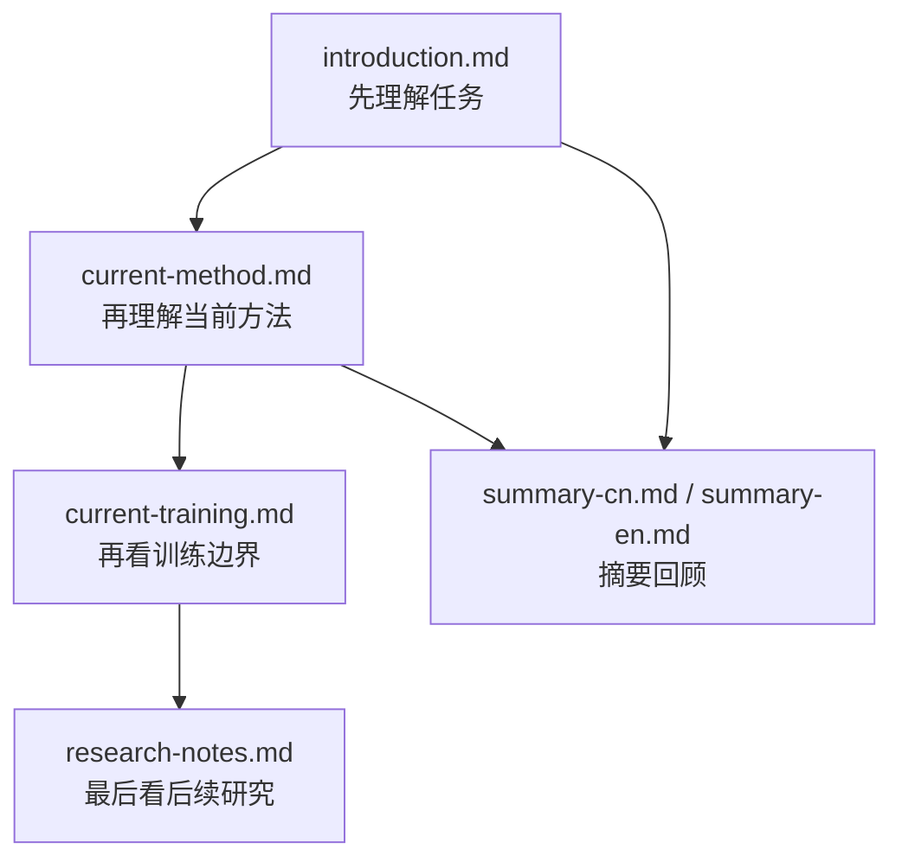

# 01-overview

这个目录负责回答三个层次的问题：

1. 任务是什么
2. 当前方法是什么
3. 后续还可以研究什么

## 目录理解图

## 推荐阅读顺序

1. [introduction.md](./introduction.md)
2. [guide.md](./guide.md)
3. [current-method.md](./current-method.md)
4. [current-training.md](./current-training.md)
5. [research-notes.md](./research-notes.md)

## 文件说明

- [introduction.md](./introduction.md)
  任务背景、数据、评估与难点。

- [guide.md](./guide.md)
  本目录的导航页，解释每篇文档的职责。

- [current-method.md](./current-method.md)
  当前采用的方法说明。

- [current-training.md](./current-training.md)
  当前方法中真正训练的模块边界。

- [research-notes.md](./research-notes.md)
  后续研究问题与下一轮实验方向。

- [summary-cn.md](./summary-cn.md)
  中文摘要版总览。

- [summary-en.md](./summary-en.md)
  英文摘要版总览。
