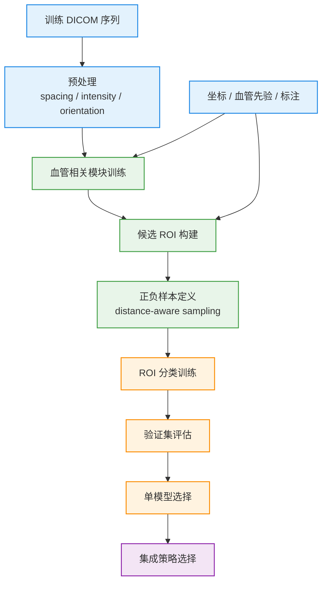
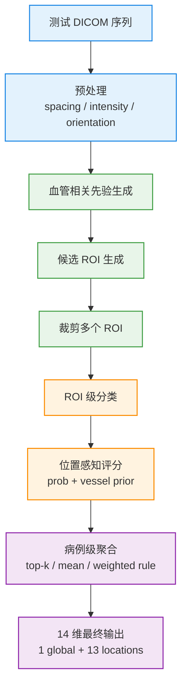
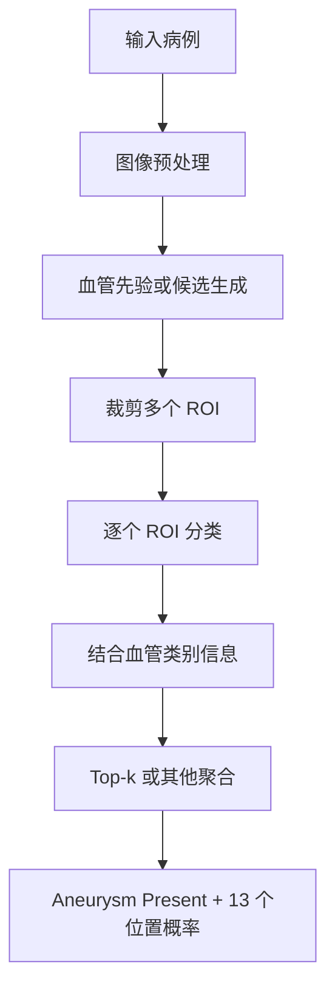

# 当前方法记录

本文记录当前采用的方法，不讨论后续研究扩展。若要看研究假设和下一步实验，请转到 [research-notes.md](./research-notes.md)。

## 方法定位

当前方案属于一条清晰的多阶段检测路线：

1. 利用血管相关信息缩小搜索空间
2. 在候选区域上进行 ROI 级判别
3. 将 ROI 分数聚合成病例级 14 维输出

它不是“整脑端到端单模型分类”，而是“结构先验 + ROI 分类 + 病例级聚合”。

## 总体 Pipeline

### 训练阶段

训练阶段的重点不是直接得到病例级输出，而是先把候选、ROI 和分类器训练扎实，再通过验证集做模型与集成决策。

颜色说明：

- 蓝色：数据与标注
- 绿色：候选生成
- 橙色：分类与验证
- 紫色：聚合与最终策略选择

### 推理阶段

推理阶段的核心是把训练阶段学到的局部判别能力，稳定地转成病例级 14 维结果。

颜色说明：

- 蓝色：输入数据
- 绿色：候选生成
- 橙色：分类
- 紫色：聚合与最终输出

## 当前 pipeline

### Stage 1: 血管区域建模与 ROI 候选生成

第一阶段的目标不是直接输出最终标签，而是回答：

> 哪些区域值得被后续模型重点看

这一步依赖血管分割或血管类别信息，作用有三个：

- 把整脑搜索改为血管约束搜索
- 为 ROI 提供更干净的候选区域
- 为后续位置标签提供解剖先验

### Stage 2: ROI 级动脉瘤分类

对 Stage 1 生成的 ROI 进行判别，输出每个 ROI 的动脉瘤概率。

当前方案的关键点是：

- 输入以局部候选区域为中心
- 用相邻切片提供有限 3D 上下文
- 重点学习病灶与正常血管分叉之间的差异

这一步负责把“疑似位置”转化为“病灶置信度”。

### Stage 3: ROI 评分与病例级聚合

单个病例通常会产生多个 ROI，因此还需要把 ROI 级结果变为病例级结果。

这一阶段主要做两类事情：

- 将 ROI 概率与血管类别信息结合，得到位置相关分数
- 将多个 ROI 的分数聚合成最终 14 个输出概率

当前方案更偏向使用稳定的规则聚合，而不是额外训练一个病例级融合模型。

## 当前输入输出关系

### 输入

- 原始 DICOM 序列
- 动脉瘤坐标信息
- 可用的血管分割或血管类别先验

### 中间表示

- 血管 mask 或血管类别图
- ROI 候选列表
- ROI 级分类概率

### 输出

- `Aneurysm Present`
- 13 个血管位置概率

## 当前方案为什么成立

### 原因 1: 降低搜索难度

动脉瘤只出现在血管相关区域，先做血管约束可以显著减少背景噪声。

### 原因 2: 强化局部判别

与整脑分类相比，ROI 分类更容易聚焦局部几何形态和纹理差异。

### 原因 3: 更容易解释

最终结果可以回溯到具体 ROI、血管类别和聚合逻辑，便于分析误检与漏检。

## 当前推理流程

推理阶段可概括为：

1. 读取并预处理 DICOM 序列
2. 生成血管相关先验或候选区域
3. 裁剪 ROI 并进行 ROI 级分类
4. 将 ROI 分数映射到病例级 14 维输出

其中真正决定性能上限的，往往不是最后一步聚合，而是前两步是否把候选做干净、做全。

## 与其他文档的边界

- 背景与任务定义：见 [introduction.md](./introduction.md)
- 当前方案里真正训练了什么：见 [current-training.md](./current-training.md)
- 后续研究方向：见 [research-notes.md](./research-notes.md)
