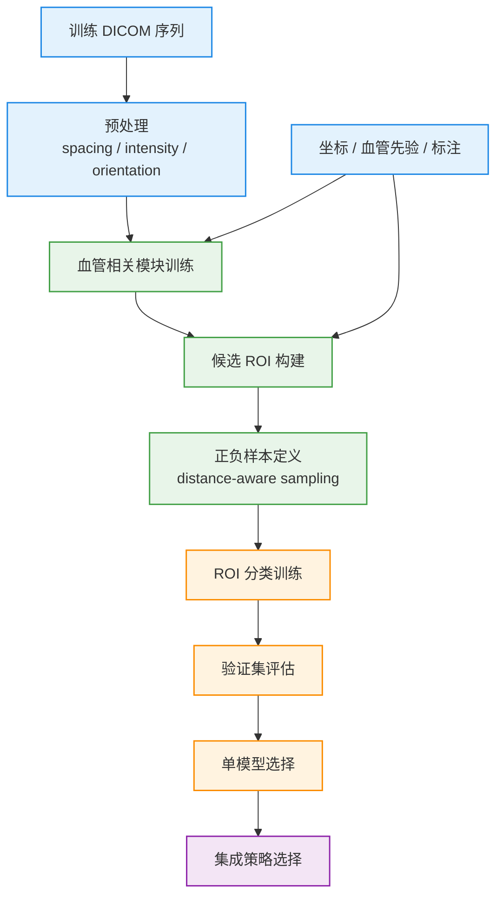
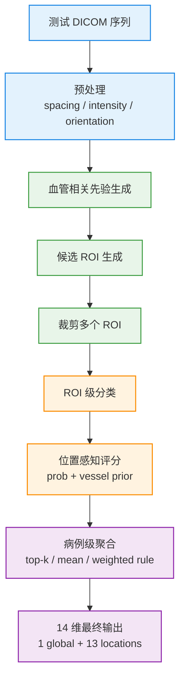
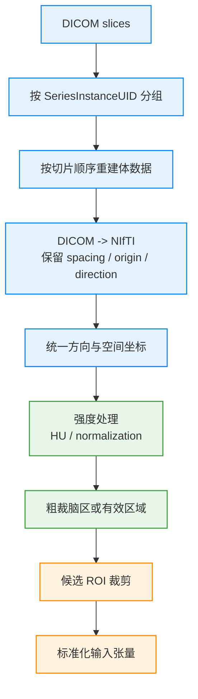
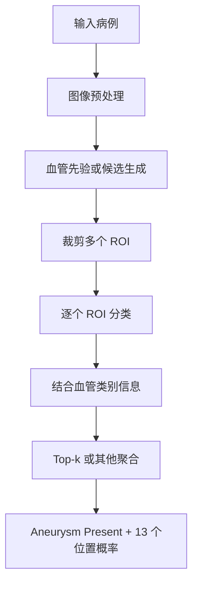

# 当前方法记录

本文记录当前采用的方法，不讨论后续研究扩展。若要看研究假设和下一步实验，请转到 [research-notes.md](./research-notes.md)。

## 方法定位

当前方案属于一条清晰的多阶段检测路线：

1. 利用血管相关信息缩小搜索空间
2. 在候选区域上进行 ROI 级判别
3. 将 ROI 分数聚合成病例级 14 维输出

它不是“整脑端到端单模型分类”，而是“结构先验 + ROI 分类 + 病例级聚合”。

## 总体 Pipeline

### 训练阶段

训练阶段的重点不是直接得到病例级输出，而是先把候选、ROI 和分类器训练扎实，再通过验证集做模型与集成决策。

颜色说明：

- 蓝色：数据与标注
- 绿色：候选生成
- 橙色：分类与验证
- 紫色：聚合与最终策略选择

### 推理阶段

推理阶段的核心是把训练阶段学到的局部判别能力，稳定地转成病例级 14 维结果。

颜色说明：

- 蓝色：输入数据
- 绿色：候选生成
- 橙色：分类
- 紫色：聚合与最终输出

## 数据预处理解析

这一部分不是辅助细节，而是整个 pipeline 能不能成立的基础。对这个项目来说，预处理至少承担四个任务：

1. 把原始 DICOM 组织成可计算的 3D 体数据
2. 保证空间坐标、像素间距和标注对齐
3. 让不同扫描的强度分布尽量可比较
4. 为后续 ROI 裁剪和分类训练提供稳定输入

### 预处理主流程图

### 1. DICOM 到体数据，不只是“读文件”

实际处理时，第一步不是直接把单张切片喂给模型，而是先把同一个病例的 DICOM 切片组织成完整体数据。

这里至少要做：

- 按 `SeriesInstanceUID` 分组，避免把不同序列混在一起
- 按切片顺序重建 3D 体数据，而不是按文件名排序
- 读取并保留关键空间元数据：
  - `PixelSpacing`
  - `SliceThickness` 或层间距信息
  - 图像方向与原点

如果这一层出错，后面最常见的问题是：

- 坐标映射漂移
- 血管 mask 与原图错位
- ROI 裁块中心不落在真实病灶上

### 2. DICOM -> NIfTI 的真正意义

把 DICOM 转成 NIfTI 的意义不是“换个后缀名”，而是为了得到一个更稳定的三维数据表示，便于：

- 保存完整的体数据结构
- 统一读取方式
- 保留 affine 和空间坐标关系
- 后续和 mask、坐标、ROI 裁剪逻辑对齐

因此这里的关键不是转换本身，而是：

- 转换后必须保留 `spacing`
- 保留方向信息
- 保留原点和体素坐标到物理坐标的映射关系

否则后续的病灶坐标、血管先验和 ROI 中心都会失真。

### 3. 空间一致性处理

医疗影像里最容易被低估的不是模型，而是空间不一致。

当前预处理至少要考虑：

- 不同病例层厚不同
- 不同扫描的 voxel spacing 不同
- 不同设备和协议下方向矩阵不同

因此通常需要：

- 统一方向
- 检查 spacing
- 必要时做重采样

这里要注意一件事：

> 是否重采样，不只是工程方便，而是直接决定 `64^3` patch 代表的真实物理尺度是否一致。

如果一个病例的 `64^3` 代表 20 mm，另一个代表 45 mm，那么同样大小的 ROI 就不再对应同一种病灶上下文。

### 4. HU windowing 主要服务可视化，不等同于训练归一化

你给出的 `HU windowing [-100, 300]` 是合理的 CTA 可视化窗口，但它要和训练时的强度处理区分开。

更准确地说：

- `HU windowing` 主要用于把血管和软组织显示得更清楚，便于人工检查
- 训练时是否直接使用该窗口，要看具体建模方案

常见做法是：

- 可视化时使用固定窗口，如 `[-100, 300]`
- 训练输入时做更稳定的截断与归一化，例如：
  - 先裁掉极端值
  - 再做 `z-score normalization`

这两者不是一回事。

### 5. Z-score normalization 的角色

`Z-score normalization` 的作用是把不同病例的强度尺度拉到相对可比较的范围。

它通常做的是：

`x_norm = (x - mean) / std`

更关键的问题不在公式，而在统计范围怎么选：

- 对整例体数据算
- 对脑区算
- 对 ROI 算

在当前项目里，更稳妥的思路通常是：

- 先排除明显无效背景
- 再在有效区域上做统计

否则大量空气背景会污染均值和方差。

### 6. ROI extraction: `64^3` 不是一句话能说清的

`64^3 patches centered on brain tissue` 这句话如果不展开，容易误导。

这里其实存在两层裁剪：

#### 第一层：粗裁有效脑区

先把整例体数据裁到脑组织或血管相关区域附近，减少明显无效背景。

这一步更像：

- brain-centered crop
- coarse field-of-view reduction

#### 第二层：候选中心 ROI

在真正进入分类器前，通常还是要围绕候选点再裁一次更局部的 patch。

这一步才是严格意义上的：

- lesion-centered ROI
- candidate-centered patch extraction

所以 `64^3` 更适合被理解为一种局部判别输入尺寸，而不是整个病例的统一表示。

### 7. 预处理和 tricks 的关系

预处理不是独立模块，它和后面的技巧强耦合：

- `segmentation-to-detection` 依赖空间对齐正确
- `vessel-class-roi` 依赖类别图和 ROI 坐标一致
- `distance-aware-negative-sampling` 依赖距离计算建立在可靠物理坐标上
- `input-2p5d` 依赖相邻切片确实对应稳定的空间上下文

也就是说，预处理质量直接限制 tricks 是否真的有效。

### 8. 实际上需要额外关注的预处理问题

除了你列出的 4 点，这个项目里还建议明确检查下面这些问题：

- 是否存在序列级别的缺片或切片顺序异常
- spacing 变化是否导致 patch 物理尺度不一致
- mask、坐标和原图是否处于同一坐标系
- ROI 裁剪到边界时是否需要 padding
- 背景区域是否过多影响 `z-score`
- 训练和推理是否使用了完全一致的预处理逻辑

### 9. 一句话总结

这个项目的预处理不是“图像清洗”，而是：

> 把原始医学影像、空间标注和候选生成逻辑变成同一个几何坐标体系下的稳定输入表示。

## 当前 pipeline

### Stage 1: 血管区域建模与 ROI 候选生成

第一阶段的目标不是直接输出最终标签，而是回答：

> 哪些区域值得被后续模型重点看

这一步依赖血管分割或血管类别信息，作用有三个：

- 把整脑搜索改为血管约束搜索
- 为 ROI 提供更干净的候选区域
- 为后续位置标签提供解剖先验

### Stage 2: ROI 级动脉瘤分类

对 Stage 1 生成的 ROI 进行判别，输出每个 ROI 的动脉瘤概率。

当前方案的关键点是：

- 输入以局部候选区域为中心
- 用相邻切片提供有限 3D 上下文
- 重点学习病灶与正常血管分叉之间的差异

这一步负责把“疑似位置”转化为“病灶置信度”。

### Stage 3: ROI 评分与病例级聚合

单个病例通常会产生多个 ROI，因此还需要把 ROI 级结果变为病例级结果。

这一阶段主要做两类事情：

- 将 ROI 概率与血管类别信息结合，得到位置相关分数
- 将多个 ROI 的分数聚合成最终 14 个输出概率

当前方案更偏向使用稳定的规则聚合，而不是额外训练一个病例级融合模型。

## 当前输入输出关系

### 输入

- 原始 DICOM 序列
- 动脉瘤坐标信息
- 可用的血管分割或血管类别先验

### 中间表示

- 血管 mask 或血管类别图
- ROI 候选列表
- ROI 级分类概率

### 输出

- `Aneurysm Present`
- 13 个血管位置概率

## 当前方案为什么成立

### 原因 1: 降低搜索难度

动脉瘤只出现在血管相关区域，先做血管约束可以显著减少背景噪声。

### 原因 2: 强化局部判别

与整脑分类相比，ROI 分类更容易聚焦局部几何形态和纹理差异。

### 原因 3: 更容易解释

最终结果可以回溯到具体 ROI、血管类别和聚合逻辑，便于分析误检与漏检。

## 当前推理流程

推理阶段可概括为：

1. 读取并预处理 DICOM 序列
2. 生成血管相关先验或候选区域
3. 裁剪 ROI 并进行 ROI 级分类
4. 将 ROI 分数映射到病例级 14 维输出

其中真正决定性能上限的，往往不是最后一步聚合，而是前两步是否把候选做干净、做全。

## 与其他文档的边界

- 背景与任务定义：见 [introduction.md](./introduction.md)
- 当前方案里真正训练了什么：见 [current-training.md](./current-training.md)
- 后续研究方向：见 [research-notes.md](./research-notes.md)
