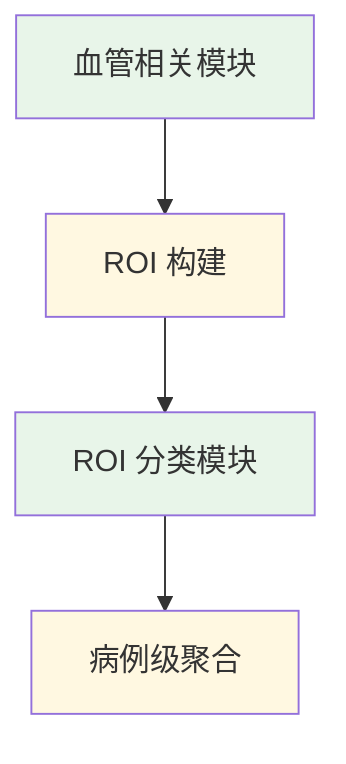

# 当前训练说明

本文只回答一个问题：

> 当前方案里，哪些部分真的训练了模型，哪些部分没有。

## 结论先行

当前方法的核心训练集中在两个层面：

1. 血管相关建模模块
2. ROI 级分类模块

病例级聚合本身不属于主要训练对象，更像规则设计或轻量后处理。

## 训练边界图

## 1. 会训练的部分

### 血管相关模块

这一部分负责提供血管区域、血管类别或 ROI 候选。

它的训练价值在于：

- 给下游提供搜索空间约束
- 帮助构造更干净的 ROI
- 为位置标签提供解剖先验

如果这一层召回不足，下游分类再强也很难补回来。

### ROI 分类模块

这一部分是真正的病灶判别主体。

它接收 ROI 输入，输出局部动脉瘤概率。当前方法的主要训练成本、模型选择和调参工作，基本都集中在这里。

这也是结果文档里大部分单模型与集成实验的来源。

## 模块职责图

## 2. 不作为主要训练对象的部分

### ROI 构建规则

包括：

- 如何从血管区域里采样候选点
- 如何根据距离规则构造负样本
- 如何绑定血管类别

这些更偏工程设计，不是单独训练一个网络来完成。

### 病例级聚合

包括：

- `max`
- `top-k mean`
- 简单平均
- 加权平均

这部分通常基于验证集比较不同规则，而不是重新训练一个大型模型。

## 3. 为什么要这样拆

### 原因 1: 训练目标更清晰

血管相关模块负责“看哪里”，ROI 分类负责“这是不是病灶”，二者职责分离后更容易定位问题。

### 原因 2: 调试成本更低

如果候选阶段漏召回，问题不会被错误地归因到分类器；如果 ROI 质量很好但病例级结果差，则重点排查聚合。

### 原因 3: 结果分析更直接

单模型实验可以专注于 ROI 分类器本身，集成实验则专注于病例级融合策略，不会混在一起。

## 4. 当前文档体系里的对应关系

- 当前整体方法：见 [current-method.md](./current-method.md)
- 单模型结果：见 [model-database-cn.md](../03-results/model-database-cn.md)
- 集成结果：见 [ensemble-results-cn.md](../03-results/ensemble-results-cn.md)

## 5. 一句话版本

当前方案不是训练“三个等权重模型”，而是：

> 重点训练血管相关模块和 ROI 分类模块，再用规则化聚合把 ROI 结果变成病例级预测。
