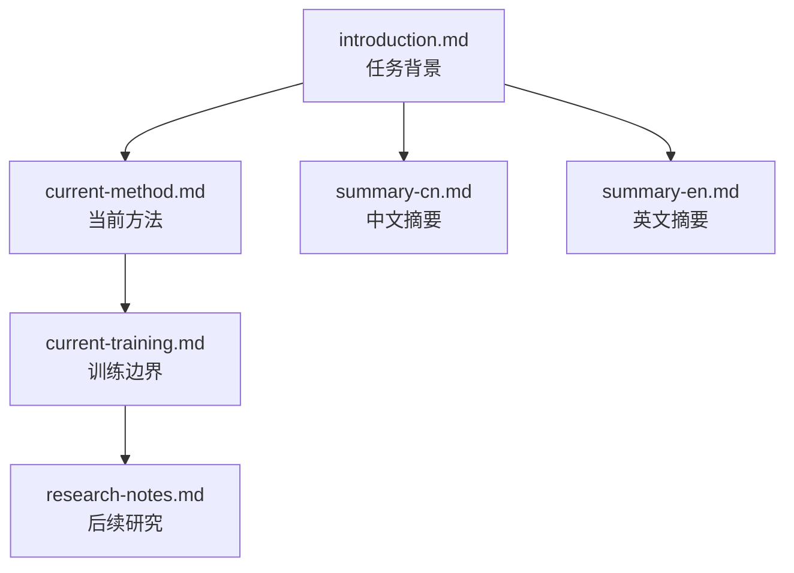

# Overview Guide

本文不是方法文档，而是 `docs/01-overview/` 子目录的导航页。

## Overview Map

图中的节点可以直接点击跳转到对应文件。

## 每篇文档的职责

### `introduction.md`

负责建立任务认知：

- 这个竞赛在做什么
- 数据是什么
- 评价指标和任务难点是什么

### `current-method.md`

负责说明当前采用的方法。

重点是：

- 当前 pipeline 的阶段划分
- 每个阶段的输入、输出和作用
- 当前推理流程如何得到最终 14 个概率

### `current-training.md`

负责说明当前方法里真正训练的部分。

重点是：

- 哪些阶段训练了模型
- 哪些阶段只是规则、筛选或聚合
- 当前训练成本主要落在哪些模块

### `research-notes.md`

负责记录后续研究。

重点是：

- 已观察到的实验规律
- 值得继续验证的研究问题
- 后续可能推进的模型和集成方向

### `summary-cn.md` / `summary-en.md`

负责提供中英文摘要版总览，适合快速回顾和对外沟通。

## 推荐用法

- 想快速理解任务：先看 `introduction.md`
- 想知道当前怎么做：看 `current-method.md`
- 想知道真正训练了什么：看 `current-training.md`
- 想规划下一步研究：看 `research-notes.md`
- 想做摘要或对外表达：看 `summary-cn.md` 或 `summary-en.md`
