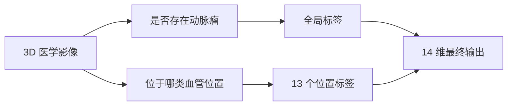

# RSNA 颅内动脉瘤检测项目简介

本文只负责建立任务认知，不展开当前实现细节。当前方法请看 [current-method.md](./current-method.md)。

## 1. 任务是什么

RSNA Intracranial Aneurysm Detection 的目标是从脑部血管影像中判断：

- 是否存在动脉瘤
- 动脉瘤位于哪一类血管位置

最终需要为每个病例输出 14 个概率：

- 1 个全局标签：`Aneurysm Present`
- 13 个解剖位置标签

这本质上是一个带定位含义的多标签分类任务。

## 任务理解图

## 2. 为什么这个任务难

### 病灶小

动脉瘤通常只占据扫描中的极小区域，属于典型的“大体积中找微小病灶”问题。

### 3D 数据复杂

输入不是普通 2D 图片，而是多切片医学体数据。不同病例的切片数、层厚、方向和模态都可能不同。

### 类别不平衡

很多病例没有动脉瘤，即使是阳性病例，13 个位置标签也很稀疏。

### 多中心分布差异

数据来自多个机构与不同设备，真实临床分布更复杂，也更容易出现 domain shift。

## 3. 数据由什么组成

### `train.csv`

提供病例级 14 个标签，是最终监督目标。

### `train_localizers.csv`

提供动脉瘤坐标信息。它不是最终提交内容，但对候选生成和 ROI 构建非常关键。

### DICOM 序列

构成原始 3D 医学影像输入，包含 CTA、MRA、MRI 等模态。

### 分割标注

一部分病例带有血管分割信息，可用于建立血管先验或候选区域生成模块。

## 4. 评价指标意味着什么

该任务最终按病例输出 14 个概率，并以加权方式评价整体表现。核心含义不是“只要分类就行”，而是：

- 既要判断有没有动脉瘤
- 也要尽量把概率分配到正确的血管位置

因此高分方法通常不会直接做粗粒度分类，而是引入定位、ROI 和聚合过程。

## 5. 常见高分思路

尽管最终输出是分类概率，高分方案通常都采用多阶段 pipeline：

1. 先建立血管或候选区域先验
2. 再在候选区域内做病灶判别
3. 最后把 ROI 级预测聚合成病例级结果

这类设计的本质是减少搜索空间、控制假阳性、增强局部结构判别能力。

## 6. 本项目该如何理解

如果只用一句话概括本项目：

> 这是一个借助血管先验与 ROI 机制，将“大海捞针式全局分类”改写为“候选区域精细判别”的医学影像检测项目。

理解完背景后，建议继续阅读：

1. [guide.md](./guide.md)
2. [current-method.md](./current-method.md)
3. [current-training.md](./current-training.md)
