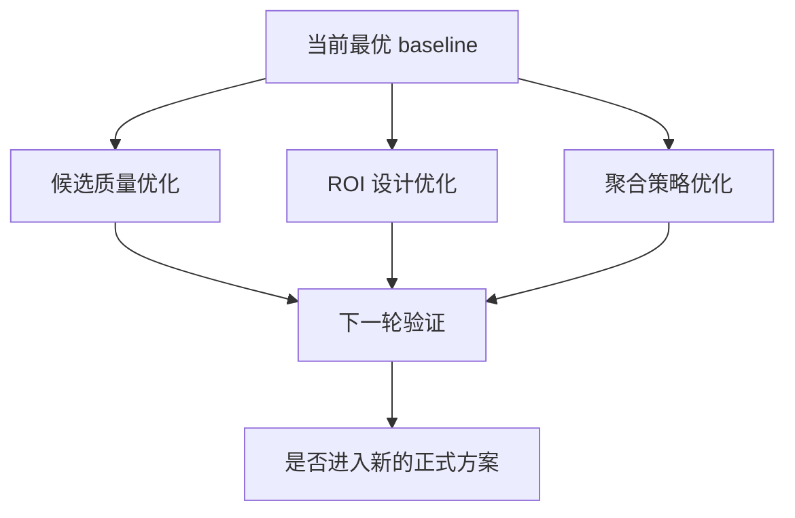

# Deep Insight

本文是后续研究文档，不是当前正式方案说明。

当前方法请优先阅读：

- [current-method.md](./current-method.md)
- [current-training.md](./current-training.md)

## 研究推进图

## 已观察到的稳定现象

### 1. 小模型往往优于大模型

从现有实验看，较小的 CNN 架构在该任务上更稳定，说明数据规模和任务噪声不足以支撑大模型复杂度。

### 2. SE-ResNet 家族表现最稳

SE 模块对血管类局部结构识别有明显帮助，当前最佳单模型和最优集成都集中在这一家族。

### 3. 纯粹追求更多模型数没有明显收益

集成规模在 5 到 6 个模型附近达到最优，再往上通常只会引入冗余和噪声。

### 4. 规则设计与候选质量同样关键

当前结果表明，候选区域是否干净、负样本是否足够“难”、病例级聚合是否稳健，对最终表现影响不低于 backbone 选择。

## 当前可继续研究的问题

### 研究方向 1: 候选质量是否仍是主瓶颈

可以继续验证：

- 更高召回的血管候选是否能提升最终病例级 AUC
- 不同 ROI 尺寸是否会改变假阳性分布
- 负样本是否需要按血管类别分别构造

### 研究方向 2: 2.5D 与 3D 的真实收益边界

当前 2.5D 更务实，但仍可继续验证：

- 3D ROI 分类是否能在高疑难样本上提升表现
- 多平面 2.5D 是否比单平面更稳
- 2.5D 主模型加 3D 二判是否优于单一方案

### 研究方向 3: 病例级聚合还能否继续提升

可测试的方向包括：

- 血管内 `top-k mean` 与全局 `top-k mean` 的差别
- 基于校准后的概率再聚合
- 使用轻量学习式融合替代固定权重

### 研究方向 4: 位置标签建模是否需要更强先验

当前位置预测更多依赖血管类别和聚合逻辑，后续可探索：

- 显式坐标编码
- 类别感知 ROI 头
- 解剖图谱或左右侧约束

## 下一轮实验建议

### 第一优先级

- 固定最佳 ROI 分类 backbone，先只动候选与聚合
- 复测 `top-k`、负样本距离阈值、ROI 尺寸
- 将实验结论和当前最优集成结果联动分析

### 第二优先级

- 做 2.5D 与 3D 二判的小规模对照
- 验证类别感知 ROI 是否改善位置标签

### 第三优先级

- 探索更复杂的 meta ensemble
- 评估是否值得引入更重的 transformer 系列

## 记录原则

后续往本文补充内容时，建议只记录三类信息：

- 已被实验支持的规律
- 尚未验证但值得投入的假设
- 明确放弃的方向及原因

这样可以避免它重新膨胀成另一份“当前方法说明书”。
