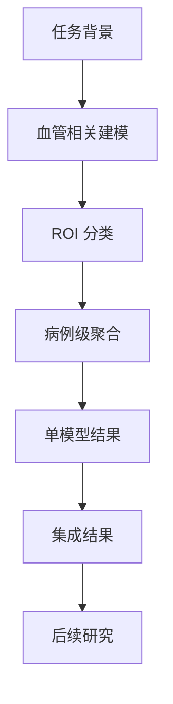

# RSNA 项目中文摘要

本项目面向 RSNA 颅内动脉瘤检测任务，核心目标是从 3D 医学影像中输出 14 个病例级概率，包括 1 个全局存在标签和 13 个血管位置标签。

## 项目总览图

## 核心判断

这个任务不适合被简单理解为“整脑分类”。更合理的思路是：

1. 先利用血管先验缩小搜索空间
2. 再对候选 ROI 做局部病灶判别
3. 最后把 ROI 级结果聚合成病例级输出

## 当前方法

当前项目采用“血管相关建模 + ROI 分类 + 病例级聚合”的多阶段框架。它的价值在于：

- 降低大体积背景噪声
- 提高局部结构识别能力
- 让位置标签预测更容易和更可解释

详细方法见 [current-method.md](./current-method.md)。

## 当前训练重点

真正训练成本主要落在两个部分：

- 血管相关模块
- ROI 分类模块

病例级聚合主要靠规则和验证集选择，不是主要训练对象。详细说明见 [current-training.md](./current-training.md)。

## 当前实验结论

- 小型 CNN 往往优于更大的模型
- SE-ResNet 家族最稳定
- 5 到 6 个模型的集成通常最优
- 复杂 TTA 和过大集成规模收益有限

详细实验见：

- [model-database-cn.md](../03-results/model-database-cn.md)
- [ensemble-results-cn.md](../03-results/ensemble-results-cn.md)

## 后续研究

后续更值得投入的方向不是无上限堆更大 backbone，而是继续优化：

- 候选质量
- 负样本构造
- ROI 设计
- 病例级聚合

对应研究笔记见 [research-notes.md](./research-notes.md)。
