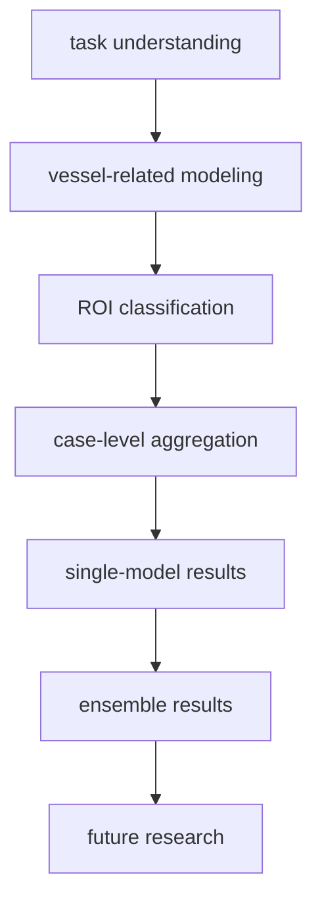

# RSNA Project Summary

This project targets the RSNA intracranial aneurysm detection task. The final objective is to output 14 case-level probabilities from 3D medical scans: 1 global presence label and 13 anatomical location labels.

## Project Overview

## Core View

This is not best handled as naive whole-volume classification. A more effective framing is:

1. use vessel-related priors to reduce the search space,
2. classify local ROIs instead of the whole brain,
3. aggregate ROI scores into the final case-level prediction.

## Current Method

The current pipeline follows a multi-stage design:

- vessel-related modeling,
- ROI-level aneurysm classification,
- case-level aggregation.

This improves signal-to-noise ratio, focuses learning on local vascular structures, and makes location prediction more interpretable. See [current-method.md](./current-method.md).

## What Is Actually Trained

Most training effort is concentrated in:

- the vessel-related module,
- the ROI classifier.

Case-level aggregation is mainly rule-based and selected through validation rather than trained as a major standalone model. See [current-training.md](./current-training.md).

## Current Experimental Conclusions

- smaller CNNs are generally more stable than larger ones,
- the SE-ResNet family is the strongest overall,
- ensembles peak around 5 to 6 models,
- heavy TTA and overly large ensembles bring limited value.

See:

- [model-database-en.md](../03-results/model-database-en.md)
- [ensemble-results-en.md](../03-results/ensemble-results-en.md)

## Future Work

The next gains are more likely to come from:

- better candidate generation,
- stronger negative sampling,
- improved ROI design,
- better case-level aggregation,

rather than simply scaling backbone size. See [research-notes.md](./research-notes.md).
