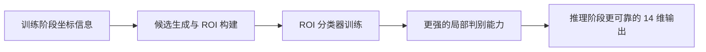
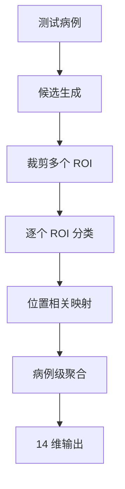

# 为什么最终提交是分类，却仍然需要定位信息

这个问题的核心不在提交格式，而在训练难度。

## 结论

定位信息不是最终输出，但它是构造高质量分类器的重要中间监督。

换句话说：

> 定位信息负责告诉模型“去哪里看”，分类结果负责回答“那里是不是动脉瘤”。

## 训练与推理关系图

## 为什么只做全局分类会很难

动脉瘤在 3D 扫描里通常非常小。如果只给模型病例级标签，它需要在大量正常组织里自己发现微小病灶，这个学习过程非常低效，也很容易被背景淹没。

## 定位信息可以怎样使用

### 用法 1: 生成候选区域

已知坐标可以帮助我们构造：

- 正样本 ROI
- 远离病灶的负样本 ROI
- 候选采样规则

这会直接提升 ROI 分类数据集的质量。

### 用法 2: 训练候选生成模块

定位信息也可以被用来训练热图、候选点或局部响应模块，让模型先找到“可疑区域”，再交给分类器判断。

### 用法 3: 强化位置标签预测

位置坐标和血管先验结合后，更容易把局部病灶分数映射到 13 个解剖位置标签，而不是只得到一个模糊的全局概率。

## 在当前方案里的角色

在当前方法里，定位信息主要是服务这三件事：

1. 约束 ROI 构建
2. 改善负样本采样
3. 提高位置相关输出的合理性

它不是最终提交内容，但对最终分类质量有直接影响。

## 推理时会发生什么

测试阶段没有真实坐标，因此流程是：

1. 先根据血管相关模块或候选生成逻辑找到疑似区域
2. 再对 ROI 做局部分类
3. 最后把多个 ROI 分数聚合成 14 维输出

所以训练时使用定位信息，本质上是在为推理阶段构建一个更靠谱的“看哪里”机制。

## 推理决策图

