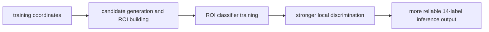
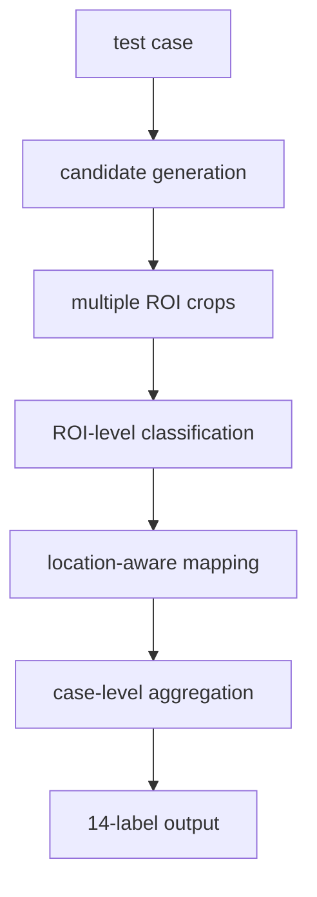

# Why Localization Is Still Useful When the Final Submission Is Classification

The key issue is not the submission format. It is the difficulty of learning.

## Short Answer

Localization is not the final output, but it is a strong intermediate supervision signal for building a better classifier.

In simple terms:

> localization tells the model where to look, and classification decides whether that region is truly aneurysmal.

## Training-to-Inference Flow

## Why Pure Global Classification Is Hard

Aneurysms are tiny relative to the full 3D scan. If the model only sees case-level labels, it must discover subtle lesions inside a huge amount of normal tissue. That is inefficient and highly vulnerable to background noise.

## How Localization Helps

### Use 1: build better ROIs

Known coordinates help define:

- positive ROIs,
- negative ROIs far from lesions,
- cleaner candidate sampling rules.

That directly improves the ROI classification dataset.

### Use 2: train a candidate-generation stage

Localization can supervise a heatmap or proposal stage so the pipeline first highlights suspicious regions before classification.

### Use 3: support anatomical labels

Coordinates combined with vessel priors make it easier to map local evidence into the 13 anatomical location outputs instead of only a vague global score.

## Role in the Current Method

In the current pipeline, localization mainly helps with:

1. ROI construction,
2. negative sampling,
3. more reliable location-aware outputs.

It is not submitted directly, but it materially improves the final classification quality.

## What Happens at Inference Time

At test time there are no ground-truth coordinates, so the pipeline must:

1. generate vessel-based or candidate-based suspicious regions,
2. classify each ROI,
3. aggregate ROI scores into the final 14 outputs.

Using localization during training is therefore a way to build a stronger internal mechanism for deciding where the model should look.

## Inference Decision Flow

