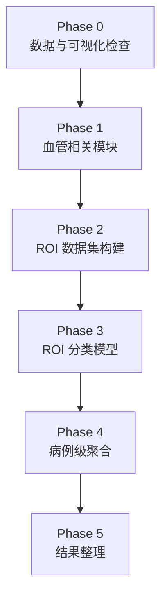
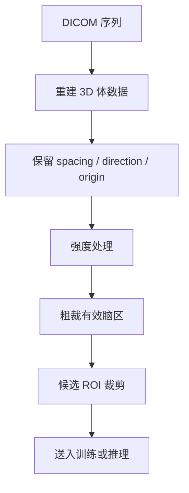
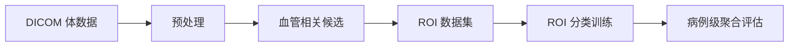

# 当前方案复现路径

本文只服务于“如何落地当前方案”，不重复讲项目背景。若需要先理解任务，请看 [introduction.md](../01-overview/introduction.md)。

## 总体原则

复现顺序建议保持为：

1. 先把数据读对
2. 再把候选做对
3. 最后再优化分类器和聚合

原因很简单：前面步骤一旦出错，后面的实验很容易得到假结论。

## 复现阶段图

## Phase 0: 数据与可视化检查

先完成四件事：

1. 读取 DICOM 序列并按切片顺序重建体数据
2. 统一 spacing、方向和强度归一化策略
3. 把动脉瘤坐标正确映射到体素空间
4. 用可视化确认坐标、血管区域和图像确实对齐

这一阶段的目标不是训练，而是避免后面所有实验都建立在错误预处理上。

### Phase 0 需要重点确认的预处理事项

#### DICOM 重建

- 按 `SeriesInstanceUID` 聚合同一序列
- 用真实切片顺序重建体数据，而不是依赖文件名
- 检查是否有缺片、重复片或异常方向

#### 空间元数据保留

- 转 NIfTI 时保留 `spacing`
- 保留方向矩阵与原点
- 确认坐标、mask、体数据共用同一空间参考

#### 强度处理

- `HU windowing [-100, 300]` 更适合可视化检查
- 训练输入建议和可视化窗口分开设计
- `z-score normalization` 建议在有效区域而不是整幅含空气背景的体数据上统计

#### ROI 前的粗裁剪

- 先缩小到脑区或有效视野
- 再进入候选级 `64^3` 裁块
- 不要把“粗裁脑区”和“候选 ROI”混成一步

### 预处理检查图

## Phase 1: 血管相关模块

这一阶段的目标是给下游提供候选空间和解剖先验。

建议产出：

- 血管 mask 或血管类别图
- 基于血管区域的候选点或 ROI 列表

验证重点：

- 召回是否足够
- 噪声候选是否可控
- 血管类别是否稳定

## Phase 2: ROI 数据集构建

构造 ROI 数据时，建议同步做好三件事：

1. 正样本覆盖真实病灶中心
2. 负样本和病灶保持足够距离
3. 记录 ROI 对应的血管类别和空间信息

如果这一步的数据定义模糊，分类器通常会先学会背景噪声而不是病灶模式。

## 数据到训练图

## Phase 3: ROI 分类模型

当前方法更适合从 ROI 分类器开始做系统比较。

建议固定：

- 统一的 ROI 尺寸
- 统一的数据增强
- 统一的验证拆分

再比较：

- backbone 家族
- 学习率与 batch size
- 2.5D 与更强空间建模方式

## Phase 4: 病例级聚合

在 ROI 预测稳定后，再评估病例级策略。

建议优先比较：

- `max`
- `top-k mean`
- 血管内聚合后再病例级汇总
- 是否需要简单权重

不要一开始就上复杂融合，否则很难判断收益来自哪里。

## Phase 5: 结果整理

最终建议把结果拆成两个层面记录：

- 单模型结论：见 [model-database-cn.md](../03-results/model-database-cn.md)
- 集成结论：见 [ensemble-results-cn.md](../03-results/ensemble-results-cn.md)

## 最后提醒

当前项目最容易浪费时间的地方，不是模型不够大，而是：

- 坐标映射不准
- ROI 构建不稳定
- 负样本太简单
- 聚合规则和训练目标不一致

先把这些基础问题收紧，再谈更复杂的研究扩展。
