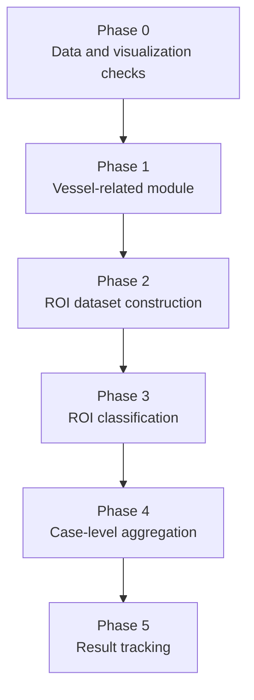
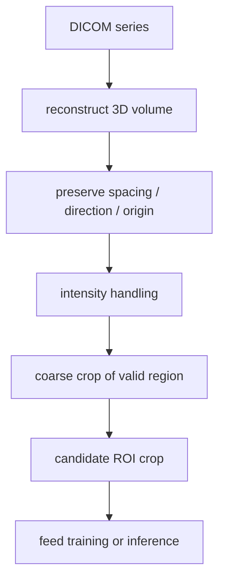
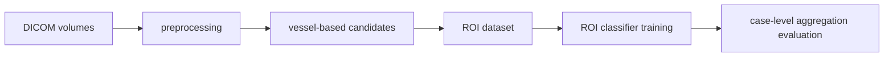

# Reproduction Path for the Current Method

This document focuses on how to implement the current pipeline. It does not repeat the competition background. For the task introduction, see [introduction.md](../01-overview/introduction.md).

## Guiding Principle

Keep the implementation order strict:

1. get the data loading and alignment right,
2. get candidate generation right,
3. then optimize classification and aggregation.

If the early stages are wrong, later experiments become misleading.

## Reproduction Stages

## Phase 0: Data and Visualization Checks

Finish these first:

1. rebuild DICOM series into valid volumes,
2. normalize spacing, orientation, and intensity,
3. map aneurysm coordinates correctly into voxel space,
4. verify alignment visually.

This phase exists to prevent every later experiment from being built on bad preprocessing.

### Phase 0 preprocessing checks that matter most

#### DICOM reconstruction

- group slices by `SeriesInstanceUID`,
- rebuild the volume using real slice order rather than filenames,
- check missing slices, duplicates, or abnormal orientation.

#### Spatial metadata preservation

- keep `spacing` during NIfTI conversion,
- preserve direction matrix and origin,
- make sure coordinates, masks, and volumes share the same spatial reference.

#### Intensity handling

- `HU windowing [-100, 300]` is more useful for visualization,
- training normalization should be designed separately from display windowing,
- `z-score normalization` is usually more stable on valid regions than on full volumes with large air background.

#### Coarse crop before ROI crop

- first reduce the field of view to the brain or valid region,
- then perform candidate-level `64^3` cropping,
- do not collapse coarse crop and lesion-centered ROI extraction into a single unclear step.

### Preprocessing Check Flow

## Phase 1: Vessel-Related Module

The goal here is to provide search-space reduction and anatomical priors.

Expected outputs:

- a vessel mask or vessel class map,
- candidate points or ROI proposals derived from vessels.

Main validation points:

- recall,
- candidate noise level,
- vessel class stability.

## Phase 2: ROI Dataset Construction

When building the ROI dataset, make sure to enforce:

1. positive ROIs truly cover the lesions,
2. negative ROIs keep sufficient distance from lesions,
3. each ROI retains vessel-class or spatial metadata when available.

If ROI definition is weak, the classifier will mostly learn background shortcuts.

## Data-to-Training Flow

## Phase 3: ROI Classification

This is the main place to compare model families systematically.

Keep these fixed first:

- ROI size,
- augmentation policy,
- validation split.

Then compare:

- backbone families,
- learning rate and batch size,
- 2.5D against stronger spatial modeling variants.

## Phase 4: Case-Level Aggregation

Only after ROI prediction is stable should you optimize case-level prediction.

Compare simple baselines first:

- `max`,
- `top-k mean`,
- vessel-wise aggregation before case-level fusion,
- light weighting if needed.

Avoid complex fusion too early, or you will not know where the gains come from.

## Phase 5: Result Tracking

Keep records at two levels:

- single-model conclusions: [model-database-en.md](../03-results/model-database-en.md)
- ensemble conclusions: [ensemble-results-en.md](../03-results/ensemble-results-en.md)

## Final Note

The most common time sink in this project is not insufficient model size. It is usually one of:

- inaccurate coordinate mapping,
- unstable ROI construction,
- negatives that are too easy,
- mismatch between aggregation and training targets.

Tighten those first, then expand the research scope.
