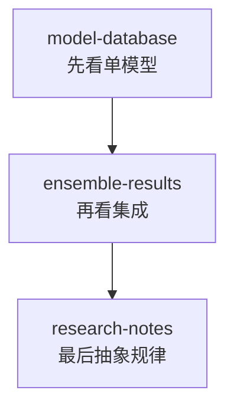

# 03-results

这个目录只负责实验结论，不重复介绍项目背景和 pipeline。

## 结果阅读图

## 推荐阅读顺序

1. [model-database-cn.md](./model-database-cn.md)
2. [ensemble-results-cn.md](./ensemble-results-cn.md)
3. [model-database-en.md](./model-database-en.md)
4. [ensemble-results-en.md](./ensemble-results-en.md)

## 文件说明

- [model-database-cn.md](./model-database-cn.md)
  中文单模型实验总结。

- [ensemble-results-cn.md](./ensemble-results-cn.md)
  中文集成实验总结。

- [model-database-en.md](./model-database-en.md)
  英文单模型实验总结。

- [ensemble-results-en.md](./ensemble-results-en.md)
  英文集成实验总结。
