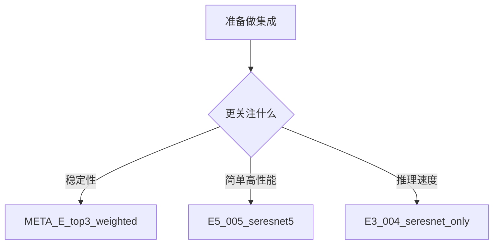

# 集成实验总结

本文只保留集成层面的主要结论，不重复单模型分析。

## 结论先行

- 最优宏平均 AUC：`0.8624`
- 最优集成规模：`5-6` 个模型
- 最优家族：`SE-ResNet`
- 复杂 TTA 收益有限
- 简单平均通常已经足够好

## 推荐的三种集成形态

### 1. 最稳健

- `META_E_top3_weighted`
- 6 个 `SE-ResNet`
- 宏平均 AUC：`0.8624`

适合把稳定性放在第一位。

### 2. 最简洁高性能

- `E5_005_seresnet5`
- 5 个 `SE-ResNet`
- 宏平均 AUC：`0.8624`

如果你想要接近最优且实现简单，这一组最合适。

### 3. 最快推理

- `E3_004_seresnet_only`
- 3 个 `SE-ResNet`
- 宏平均 AUC：`0.8619`

适合推理成本更敏感的场景。

## 最重要的实验规律

### 1. 集成不是越大越好

模型数从 5 到 6 附近达到最好，再继续增加通常只会引入冗余，甚至拖低结果。

## 集成选择图

### 2. 强家族内部集成优于盲目多样化

当前结果说明，当 `SE-ResNet` 已经明显强于其他家族时，“只集成强家族”比“机械地追求多样性”更有效。

### 3. 加权平均只有在少数场景下才值得

普通集成里，加权平均对简单平均的优势很小；只有 meta ensemble 这类二层融合时，权重设计才开始体现收益。

### 4. TTA 不值得默认开启

现有结果显示，TTA 带来的提升很有限，却显著增加推理开销，因此不应作为默认配置。

## 对当前项目的实际建议

如果只是要一个强而稳的默认方案：

- 首选 5 个 `SE-ResNet` 的简单平均

如果更关注鲁棒性：

- 选择 6 个模型的 `META_E_top3_weighted`

如果更在意推理速度：

- 选择 3 个 `SE-ResNet` 的精简集成

## 和其他文档的关系

- 单模型结果：见 [model-database-cn.md](./model-database-cn.md)
- 后续研究方向：见 [research-notes.md](../01-overview/research-notes.md)
