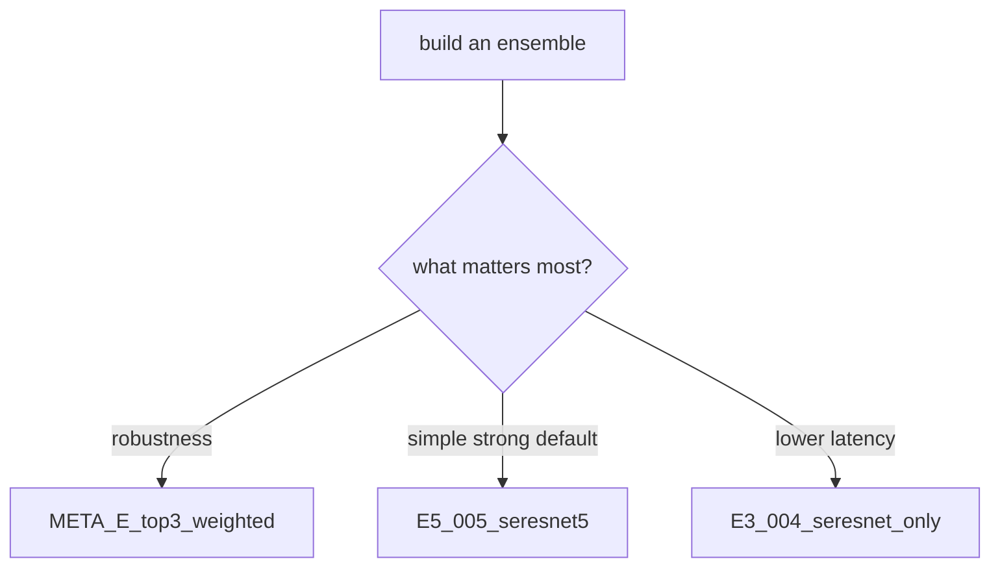

# Ensemble Summary

This document keeps only the main ensemble conclusions. It does not repeat single-model analysis.

## Key Takeaways

- best macro AUC: `0.8624`
- best ensemble size: `5-6` models
- strongest family: `SE-ResNet`
- heavy TTA adds little value
- simple averaging is usually enough

## Three Practical Ensemble Choices

### 1. Most robust

- `META_E_top3_weighted`
- 6 `SE-ResNet` models
- macro AUC: `0.8624`

Use this when robustness matters most.

### 2. Simplest strong option

- `E5_005_seresnet5`
- 5 `SE-ResNet` models
- macro AUC: `0.8624`

This is the cleanest near-optimal default.

### 3. Fastest inference

- `E3_004_seresnet_only`
- 3 `SE-ResNet` models
- macro AUC: `0.8619`

Use this when inference cost matters more.

## Most Important Patterns

### 1. Bigger ensembles are not automatically better

Performance peaks around 5 to 6 models. Beyond that, extra models mostly add redundancy and sometimes hurt.

## Ensemble Choice Flow

### 2. Strong-family ensembles beat forced diversity

Since `SE-ResNet` is already clearly stronger than the alternatives, combining strong models from the same family works better than mixing weaker families for diversity alone.

### 3. Weighted averaging rarely matters

For ordinary ensembles, weighted averaging gives little advantage over a simple mean. Weighting becomes more relevant only in meta-ensemble settings.

### 4. TTA should not be the default

The observed gain from TTA is small while the inference cost rises sharply, so it should be used selectively rather than by default.

## Practical Recommendation

If you want one strong default:

- use the 5-model `SE-ResNet` simple mean.

If you want more robustness:

- use `META_E_top3_weighted`.

If you want lower latency:

- use the 3-model `SE-ResNet` ensemble.

## Related Documents

- single-model summary: [model-database-en.md](./model-database-en.md)
- future research notes: [research-notes.md](../01-overview/research-notes.md)
