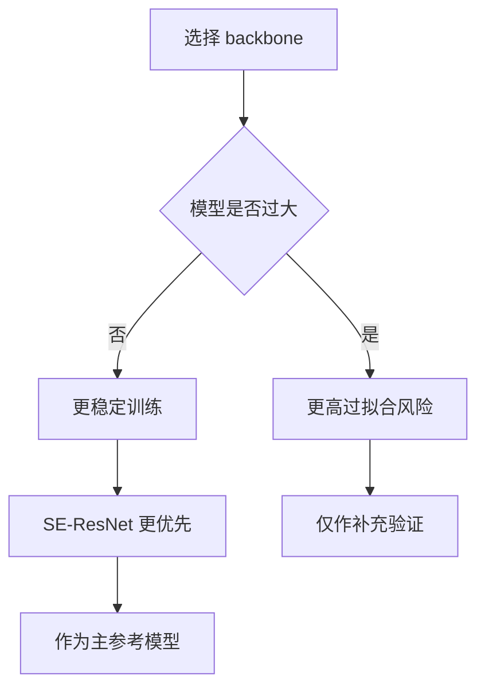

# 单模型实验总结

本文只保留单模型层面的关键信息，不再重复项目背景和当前方法。

## 核心结论

### 最佳单模型

- `SE-ResNet18 Stable`
- AUC: `0.8585`

### 最重要规律

- 小模型普遍比大模型更稳
- `SE-ResNet` 家族整体最强
- 对 transformer 类模型，冻结后再微调明显好于从头训练
- 学习率 `0.0005`、中等 batch size、较稳定的早停设置更适合当前数据规模

## 单模型决策图

## Top 10 模型

| Rank | Model | AUC | Batch Size | Notes |
|------|-------|-----|------------|-------|
| 1 | SE-ResNet18 Stable | 0.8585 | 12 | LR=0.0005, patience=15 |
| 2 | SE-ResNet18 | 0.8551 | 8 | baseline SE-ResNet18 |
| 3 | ConvNeXt-Large fine-tuned | 0.8540 | 2 | frozen then fine-tuned |
| 4 | SE-ResNet34 | 0.8538 | 8 | stable strong baseline |
| 5 | SE-ResNet50 | 0.8528 | 4 | deeper but not better |
| 6 | DenseNet-121 | 0.8514 | 8 | strongest DenseNet |
| 7 | DenseNet-121 v2 | 0.8499 | 8 | repeat run |
| 8 | ResNet-18 | 0.8498 | 8 | standard ResNet baseline |
| 9 | DenseNet-121 v3 | 0.8494 | 8 | LR=0.0005 |
| 10 | EfficientNet-B0 | 0.8492 | 8 | best EfficientNet |

## 按家族看结果

### SE-ResNet

当前最可靠的主力家族。整体表现集中在 `0.8528` 到 `0.8585` 之间，既稳定又有最优上限。

### DenseNet

是第二梯队里最稳的一类，`DenseNet-121` 明显优于更大的 `DenseNet-169`。

### Standard ResNet

可作为强基线，但整体弱于同规模的 `SE-ResNet`，说明 SE 注意力对本任务确实有帮助。

### EfficientNet / MobileNet

轻量模型并不弱，说明当前任务更偏向局部结构判别，而不是依赖极大模型容量。

### ConvNeXt / ViT / Swin

这类模型从头训练表现普遍较差。较合理的路线是：

- 使用预训练
- 冻结 backbone
- 再做有限微调

## 明确可以少投入的方向

- 过深 CNN
- 从头训练的大型 transformer
- 只靠增大参数量追求收益

这些方向在现有结果里没有体现出足够性价比。

## 对当前项目的实际含义

如果你的目标是继续优化当前方案，优先级建议是：

1. 以 `SE-ResNet18 Stable` 为主参考模型
2. 在候选、ROI 和聚合层面挖收益
3. 只把更大 backbone 作为补充验证，而不是主线
