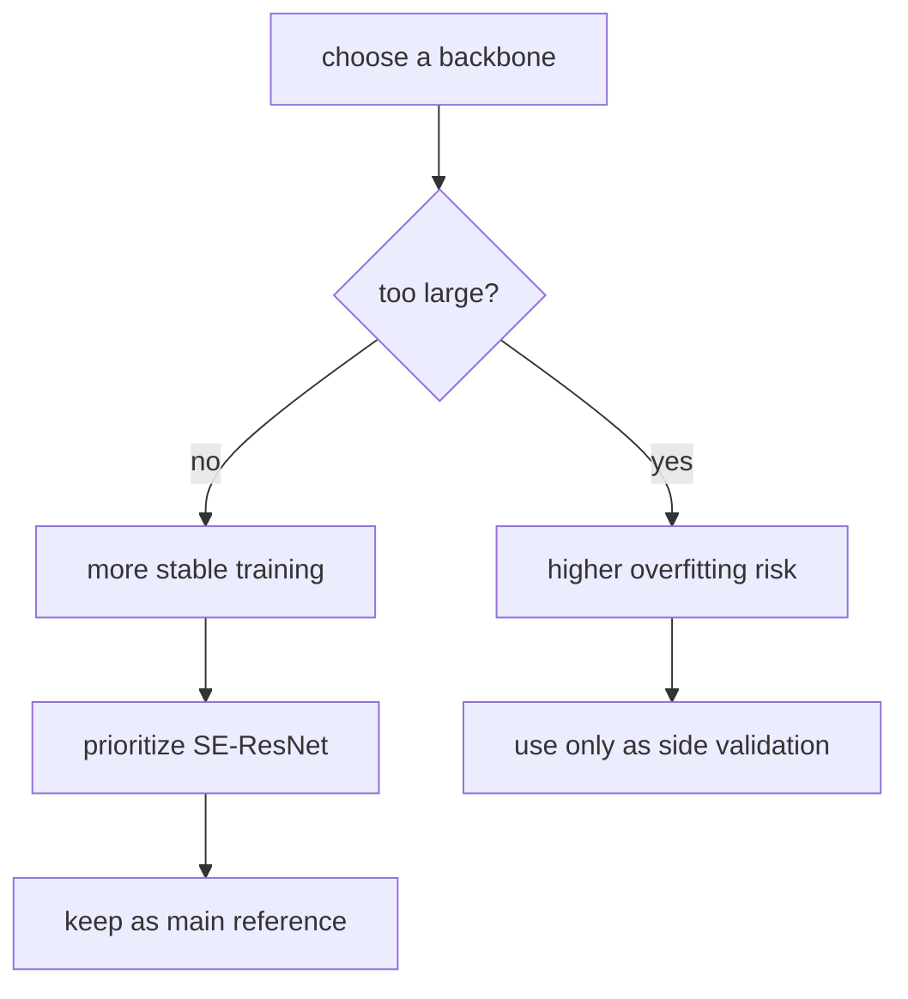

# Single-Model Summary

This document keeps only the key conclusions from the single-model experiments. It does not repeat the project background or pipeline description.

## Core Conclusions

### Best Single Model

- `SE-ResNet18 Stable`
- AUC: `0.8585`

### Most Important Patterns

- smaller models are generally more stable than larger ones,
- the `SE-ResNet` family is strongest overall,
- for transformer-style models, frozen then fine-tuned beats training from scratch,
- `0.0005` learning rate, moderate batch size, and stable early stopping work better for the current data scale.

## Single-Model Decision Flow

## Top 10 Models

| Rank | Model | AUC | Batch Size | Notes |
|------|-------|-----|------------|-------|
| 1 | SE-ResNet18 Stable | 0.8585 | 12 | LR=0.0005, patience=15 |
| 2 | SE-ResNet18 | 0.8551 | 8 | baseline SE-ResNet18 |
| 3 | ConvNeXt-Large fine-tuned | 0.8540 | 2 | frozen then fine-tuned |
| 4 | SE-ResNet34 | 0.8538 | 8 | stable strong baseline |
| 5 | SE-ResNet50 | 0.8528 | 4 | deeper but not better |
| 6 | DenseNet-121 | 0.8514 | 8 | strongest DenseNet |
| 7 | DenseNet-121 v2 | 0.8499 | 8 | repeat run |
| 8 | ResNet-18 | 0.8498 | 8 | standard ResNet baseline |
| 9 | DenseNet-121 v3 | 0.8494 | 8 | LR=0.0005 |
| 10 | EfficientNet-B0 | 0.8492 | 8 | best EfficientNet |

## Family-Level Reading

### SE-ResNet

This is the most reliable family in the current project. Performance stays in the `0.8528` to `0.8585` range and sets the strongest ceiling.

### DenseNet

The second-most stable family. `DenseNet-121` is clearly better than the larger `DenseNet-169`.

### Standard ResNet

A strong baseline, but weaker than similarly sized `SE-ResNet`, which suggests the SE attention blocks matter for this task.

### EfficientNet / MobileNet

Lightweight models remain competitive, which supports the idea that this task rewards local structural discrimination more than raw model scale.

### ConvNeXt / ViT / Swin

These models perform poorly when trained from scratch. A more realistic path is:

- start from pretrained weights,
- freeze the backbone,
- then fine-tune lightly.

## Directions With Lower Priority

- very deep CNNs,
- large transformers trained from scratch,
- simply scaling parameters for its own sake.

Those directions did not show enough return in the current results.

## Practical Meaning for This Project

If the goal is to improve the current method, the priority should be:

1. keep `SE-ResNet18 Stable` as the main reference model,
2. look for gains in candidates, ROIs, and aggregation,
3. treat larger backbones as side experiments rather than the main path.
