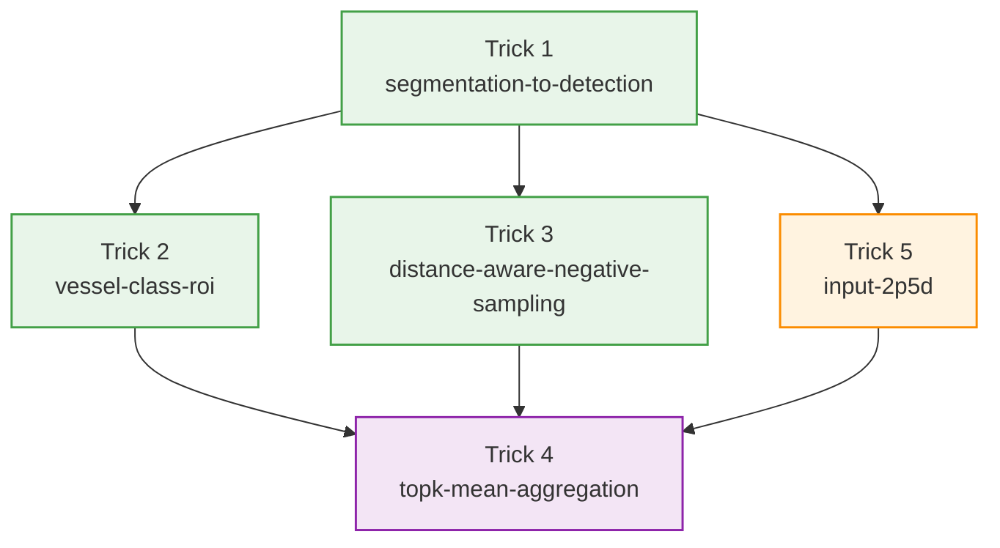
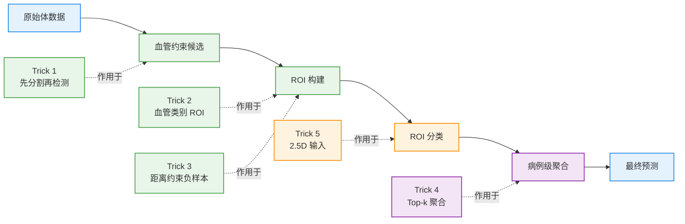

# 动脉瘤检测 5 个关键 Tricks（总览）

本文将完整方案拆为 5 个“非通用但高收益”的技巧。它们不是常规调参，而是围绕医学影像的结构先验、候选生成与病例级决策设计。

## 技巧关系图

图中的节点可以直接点击跳转到对应文件。

颜色说明：

- 绿色：候选生成与 ROI 构建相关技巧
- 橙色：分类相关技巧
- 紫色：聚合相关技巧

## Tricks 嵌入总体 Pipeline 的位置

这张图更适合回答一个实际问题：每个 trick 到底插在 pipeline 的哪一段。

颜色说明：

- 蓝色：输入与最终输出
- 绿色：候选生成 / ROI 构建
- 橙色：分类
- 紫色：聚合

## 文档索引
1. [Trick 1: 先分割血管再检测](./segmentation-to-detection.md)
2. [Trick 2: 按血管类别生成 ROI](./vessel-class-roi.md)
3. [Trick 3: 距离约束负样本采样](./distance-aware-negative-sampling.md)
4. [Trick 4: Top-k Mean 聚合](./topk-mean-aggregation.md)
5. [Trick 5: 2.5D 输入](./input-2p5d.md)

## 一句话理解每个 Trick
- Trick 1：先把“全脑搜索”收缩为“血管内搜索”，显著降低背景噪声。
- Trick 2：让 ROI 自带血管身份，显式引入解剖先验，定位更稳定。
- Trick 3：负样本采样加距离约束，减少 near-lesion 混淆噪声。
- Trick 4：病例级结果不看单点最大值，而看 top-k 证据均值，提高鲁棒性。
- Trick 5：用 2.5D 在接近 2D 成本下引入局部 3D 结构信息。

## 组合后的 Pipeline（建议表述）
1. 先做血管分割，限制候选搜索空间。
2. 按血管类别生成 ROI，并做类别感知分类打分。
3. 训练时用距离约束构造更干净的负样本。
4. 推理时对 ROI 分数做血管内 top-k 聚合得到病例/血管级预测。
5. ROI 输入采用 2.5D，补足单切片上下文不足。

## 面试/复盘可重点讲的两个点
- `Segmentation -> ROI Detection`：这是误检控制和效率提升的核心杠杆。
- `Vessel-Class Prior + Top-k Aggregation`：一个负责“结构正确”，一个负责“决策稳健”。
