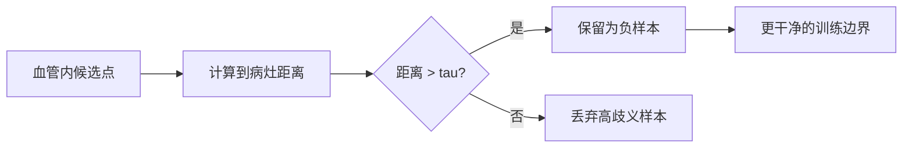

# Trick 3: 距离约束负样本采样（Distance-Aware Negative Sampling）

## 核心思路
负样本不是随机从血管里抽，而是施加空间约束：负样本中心与任意真实动脉瘤中心的距离必须大于阈值（如 `40 mm`）。

## 机制图

## 为什么有效
- 动脉瘤附近的正常血管形态往往很像病灶（near-lesion confusing negatives）。
- 若把这些区域直接当普通负样本，模型会学到混乱边界，导致训练不稳定。
- 距离约束先清理“高歧义负样本”，让模型先学到清晰的正负判别边界。

## 实际计算方式
设真实病灶中心集合为 `G = {g_1, ..., g_m}`，候选负样本中心为 `x`。

1. 计算最小欧氏距离（毫米坐标）：
`d_min(x) = min_j ||x - g_j||_2`

2. 采样规则：
- 若 `d_min(x) > tau`，`x` 可作为负样本（`tau = 40 mm` 为示例）。
- 否则丢弃。

3. 为避免分布过于简单，可在远距离区间内做分层采样：
- `40-60 mm`
- `60-90 mm`
- `>90 mm`

## 推荐采样流程
1. 从血管掩码内先生成大量候选点。
2. 计算每个候选点到最近病灶的距离。
3. 按距离阈值与分层配额抽样，构成负样本池。
4. 每个 epoch 动态重采样，减少过拟合到固定负样本。

## 进阶变体
- Curriculum：前期只用远负样本，后期逐步引入中等难度负样本。
- Semi-hard mining：在满足 `d > tau` 的前提下，优先选模型高置信误判点。

## 常见陷阱
- 用像素距离代替毫米距离会导致不同 spacing 下规则失效。
- 阈值过大可能让负样本过“干净”，泛化变差；需要验证集调参。
