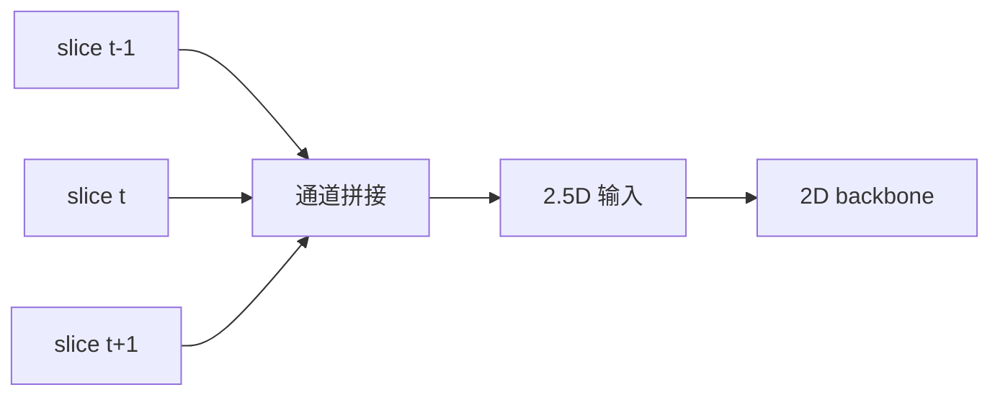

# Trick 5: 2.5D 输入（在 2D 成本下引入 3D 上下文）

## 核心思路
单个 ROI 不只喂当前切片，而是把相邻切片拼成多通道输入，例如：

`X = concat(slice[t-1], slice[t], slice[t+1])`

得到 3 通道 2.5D 表示。

## 机制图

## 为什么有效
- 动脉瘤是三维膨出结构，单切片常只看到局部截面。
- 相邻切片能提供连续形态变化信息，帮助区分“真实膨出”与“普通分叉/噪声”。
- 相比 3D CNN，2.5D 显著节省显存与训练时间。

## 具体落地
1. 在候选中心点 `z = t` 处，取 `t-d ... t ... t+d` 共 `2d+1` 张切片。
2. 作为 channel 维拼接成输入张量（如 `C = 3/5/7`）。
3. 使用 2D backbone（ResNet/EfficientNet 等）完成 ROI 分类。

## 参数建议
- `C = 3` 是稳妥起点；若层厚较大可尝试 `C = 5`。
- 采样应以物理间距为准，避免不同扫描协议导致上下文尺度不一致。
- 若做多平面输入（axial/sagittal/coronal），可在特征层融合进一步增强鲁棒性。

## 与 3D CNN 的取舍
- 2.5D 优点：训练快、显存低、部署简单、可直接复用成熟 2D 预训练权重。
- 3D 优点：体积上下文最完整。
- 实务中常见策略：先用 2.5D 做主干方案，再对少量高疑难样本用 3D 模型二判。

## 常见陷阱
- 只按索引取相邻层而忽略实际 spacing，会让“相邻层”物理距离不一致。
- 未对边界切片做 padding/镜像处理会引入输入形态偏差。
