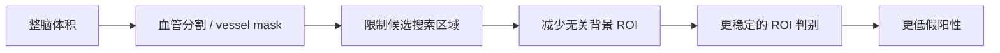

# Trick 1: 先做血管分割再做动脉瘤检测（Search Space Reduction）

## 核心思路
不是在整脑体积上直接做动脉瘤检测，而是分两阶段：

1. 先分割出血管区域（vessel mask）。
2. 再只在血管区域内生成 ROI 并做动脉瘤判别。

## 机制图

这本质上是将任务从“全空间检索”变成“血管约束检索”。

## 为什么有效
- 动脉瘤只会出现在血管壁，不会出现在脑实质任意位置。
- 3D 体积中血管占比通常很小，直接检测会出现严重前景-背景不平衡。
- 先分割可显著减少无关候选点，降低假阳性并提高训练稳定性。

## 实现流程（工程可落地）
1. 输入 CTA/MRA 体积 `V`，经过预处理（重采样、窗宽窗位/强度归一化）。
2. 分割模型输出血管概率图 `P_vessel`，阈值化得到二值掩码 `M_vessel`。
3. 对 `M_vessel` 做连通域过滤与小区域去噪。
4. 在 `M_vessel` 内生成候选中心点（例如沿中心线等距采样，或局部峰值采样）。
5. 以候选点裁剪 3D/2.5D ROI，送入分类模型得到 `p(aneurysm | ROI)`。

## 关键细节
### 候选点如何生成
- 中心线法：对血管掩码做 skeleton，沿中心线每隔 `s` mm 采样一个点。
- 密度控制：在粗大血管可加大步长，在细小分支减小步长。
- 覆盖率检查：统计候选点对血管体素的覆盖率，避免漏掉末梢区域。

### ROI 尺寸怎么选
- 常见做法是固定物理尺度（如 `16-32 mm` 立方），而不是固定像素。
- 先重采样到统一 spacing，再按毫米换算像素裁块。

## 常见失败模式与修正
- 分割漏血管导致下游不可恢复漏检：提高分割召回优先级，检测阶段再控精度。
- 分割噪声过多导致 ROI 爆炸：先做连通域和形态学过滤再采样。
