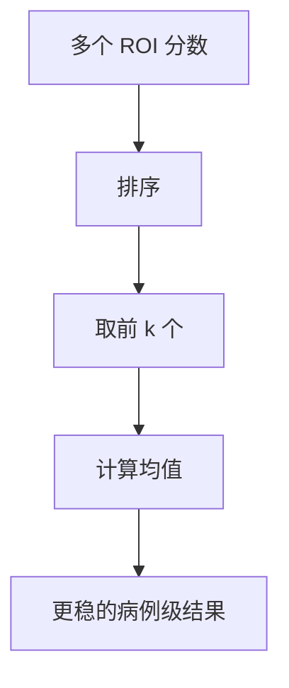

# Trick 4: Top-k Mean 聚合（Case-Level Aggregation）

## 核心思路
一个病例通常包含大量 ROI 预测，最终需要输出病例级或血管级概率。直接取 `max` 容易被单个假阳性 ROI 劫持，因此改用 Top-k 均值聚合。

## 机制图

## “Top-k 聚合实际上如何计算”
给定某病例（或某血管）下 ROI 概率集合：

`P = {p_1, p_2, ..., p_n}`

先降序排序得：

`p_(1) >= p_(2) >= ... >= p_(n)`

取前 `k` 个后求均值：

`S_topk = (1 / k) * sum_{i=1..k} p_(i)`

当 `k = 1` 时退化为 `max`，当 `k = n` 时退化为全均值。

## 小例子
`P = [0.90, 0.85, 0.70, 0.10, 0.05]`

- `Top-1 = 0.90`
- `Top-3 mean = (0.90 + 0.85 + 0.70) / 3 = 0.8167`

Top-3 相比 max 更不受单点噪声影响。

## 工程实现建议
### 按血管独立聚合
对每个血管类别 `c`，只在该类别 ROI 上算 `S_topk(c)`，再拼成多标签输出向量。

### 自适应 k
不同病例 ROI 数量差异大，可用：
- `k = min(k_fixed, n)`
- 或 `k = ceil(r * n)`（比例法，`r` 如 `5%-15%`）

### 概率校准
聚合前先做温度缩放（temperature scaling），能让 top-k 均值更可比较。

## 为什么有效
- 抑制“单个极端假阳性”对最终结果的破坏。
- 保留多个高分候选的一致证据，更符合医学影像“多证据支持”逻辑。
- 可解释性更好：能回看 top-k ROI 作为判定依据。

## 常见陷阱
- `k` 过大：把大量低质量 ROI 混入，稀释信号。
- `k` 过小：又接近 max，鲁棒性下降。
- 忽略分组：把不同血管 ROI 混算会损伤定位任务表现。
