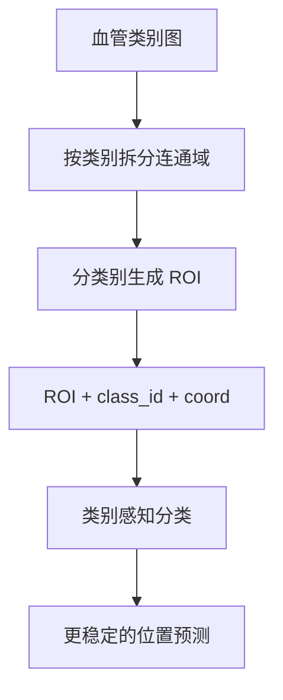

# Trick 2: 按血管类别生成 ROI（Vessel-Class ROI + Anatomical Prior）

## 核心思路
不是把所有 ROI 当成同一种候选，而是给每个 ROI 绑定“所属血管类别”信息（如 ICA、MCA、ACA、PCA、BA 等），将解剖先验显式注入模型。

## 机制图

## 为什么有效
- 任务输出通常包含“是否存在动脉瘤 + 位于哪条血管”。
- 单纯做全局二分类会把结构定位压力全部压给模型，易混淆相邻血管分支。
- 先把 ROI 与血管类别绑定，可把困难问题拆成“局部病灶判别 + 类别一致性约束”。

## 如何做到“每条血管生成 ROI”
### Step 1: 得到血管类别图
准备一个多类血管分割/标注图 `L_vessel(x)`，每个体素有类别标签（背景=0，ICA=1，MCA=2 ...）。

### Step 2: 分类别提取候选区域
对每个类别 `c`：
1. 取二值掩码 `M_c = [L_vessel == c]`。
2. 做连通域分解 `CC_c = {cc_1, cc_2, ...}`。
3. 对每个连通域取中心线点或几何中心点集 `S_{c,i}`。
4. 以 `S_{c,i}` 为中心裁剪 ROI，记录标签 `vessel_class = c`。

这样得到的是 `ROI = (patch, class_id, coord)`，而不是只有 `patch`。

### Step 3: 类别感知打分
模型可输出两路概率：
- `p_a`: ROI 为动脉瘤概率
- `p_c`: ROI 属于目标血管类别 `c` 的概率（或 one-vs-rest）

融合得分可写为：

`score_c = p_a * p_c`

或对数域稳定实现：

`log score_c = log p_a + lambda * log p_c`

其中 `lambda` 控制类别先验强度。

## 训练策略建议
- 多任务学习：共享 backbone，分两头输出 `aneurysm head` 与 `vessel head`。
- 类别不平衡：对稀有血管类别使用 class weight 或 focal loss。
- 位置编码：将归一化空间坐标 `(x, y, z)` 拼接到特征向量，增强解剖一致性。

## 常见问题
- 类别图质量差会污染 ROI 标签：优先修正分割标签，再调分类器。
- `p_a * p_c` 过于保守：可改为 `p_a^alpha * p_c^(1-alpha)` 做平衡。
