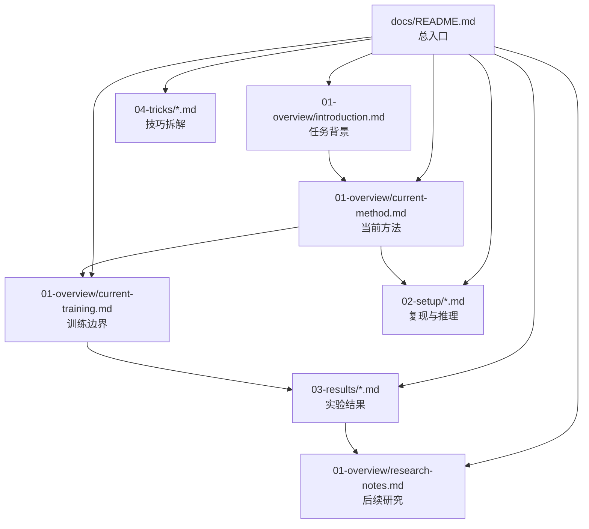

# Docs Index

`docs/` 已按长期维护的方式重构为 4 个编号目录：

- `01-overview/`：背景、当前方法、训练边界、研究笔记、摘要
- `02-setup/`：复现与推理说明
- `03-results/`：单模型与集成实验结论
- `04-tricks/`：关键技巧拆解

## 文档关系图

图中的节点可以直接点击跳转到对应文档。

## 建议阅读顺序

### 第一次进入项目

1. [introduction.md](./01-overview/introduction.md)
2. [guide.md](./01-overview/guide.md)
3. [current-method.md](./01-overview/current-method.md)
4. [current-training.md](./01-overview/current-training.md)

### 准备复现当前方案

1. [current-method.md](./01-overview/current-method.md)
2. [current-training.md](./01-overview/current-training.md)
3. [project-setup-cn.md](./02-setup/project-setup-cn.md)
4. [inference-setup-cn.md](./02-setup/inference-setup-cn.md)

### 准备看实验与下一步优化

1. [model-database-cn.md](./03-results/model-database-cn.md)
2. [ensemble-results-cn.md](./03-results/ensemble-results-cn.md)
3. [research-notes.md](./01-overview/research-notes.md)

## 目录说明

### `01-overview/`

- [introduction.md](./01-overview/introduction.md)
  项目背景、任务定义、数据与评估方式。

- [guide.md](./01-overview/guide.md)
  `01-overview/` 子目录导航，说明每篇文档职责。

- [current-method.md](./01-overview/current-method.md)
  当前采用的方法说明。

- [current-training.md](./01-overview/current-training.md)
  当前方法里哪些模块真的训练、哪些只是规则或聚合。

- [research-notes.md](./01-overview/research-notes.md)
  后续研究文档。

- [summary-cn.md](./01-overview/summary-cn.md)
  中文摘要版总览。

- [summary-en.md](./01-overview/summary-en.md)
  英文摘要版总览。

### `02-setup/`

- [project-setup-cn.md](./02-setup/project-setup-cn.md)
- [project-setup-en.md](./02-setup/project-setup-en.md)
- [inference-setup-cn.md](./02-setup/inference-setup-cn.md)
- [inference-setup-en.md](./02-setup/inference-setup-en.md)

这一组文档只负责“怎么落地当前方案”。

### `03-results/`

- [model-database-cn.md](./03-results/model-database-cn.md)
- [model-database-en.md](./03-results/model-database-en.md)
- [ensemble-results-cn.md](./03-results/ensemble-results-cn.md)
- [ensemble-results-en.md](./03-results/ensemble-results-en.md)

这一组文档只负责“实验结论是什么”。

### `04-tricks/`

- [README.md](./04-tricks/README.md)
- [segmentation-to-detection.md](./04-tricks/segmentation-to-detection.md)
- [vessel-class-roi.md](./04-tricks/vessel-class-roi.md)
- [distance-aware-negative-sampling.md](./04-tricks/distance-aware-negative-sampling.md)
- [topk-mean-aggregation.md](./04-tricks/topk-mean-aggregation.md)
- [input-2p5d.md](./04-tricks/input-2p5d.md)

这一组文档只负责“方法细节拆解”，不重复承担背景和结果总结。
